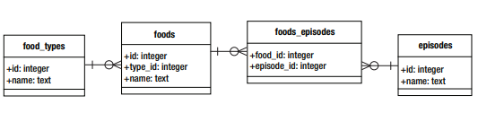
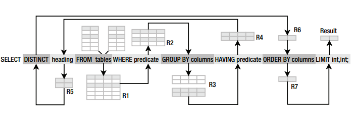

# SQL for SQLite

The database that will be used is a collection of every food introduced in Seinfeld, and the episodes they appeared in.



Here's the schema for the database:

    create table episodes (
    	id integer primary key,
    	season int,
    	name text
    );

    create table foods (
    	id integer primary key,
    	type_id integer,
    	name text
    );

    create table foods_episodes (
    	food_id integer,
    	episode_id integer
    );

    create table food_types (
    	id integer primary key,
    	name text
    );

Create the db with: `sqlite3 foods.db < foods.sql`

When writing SQL queries for this database, it's easier to pipe the commands from a file into the db using something like:

`sqlite3 foods.db < test.sql`

For better readability, add the following to the top of the .sql files:

    .echo on
    .mode column
    .headers on
    .null value NULL

Command-line program will

- echo the SQL as it is executed
- print results in column mode
- include headers
- print nulls as `NULL`

## Syntax

Reads a lot like natural language.

Begins with verb, then subject and predicate

`select id from foods where name='JujyFruit'`

SQL is more declarative than other programming languages.

### Commands

Commands are typically terminated by a semicolon.

```sql
select id, name from foods;
insert into foods values(null, 'Whataburger');
delete from foods where id=413;
```

Commands in turn, are composed of a series of _tokens_. Tokens can be literals, keywords, identifiers, expressions, or special characters.

### Literals

Also called _constants_, they denote explicit values.

Three kinds:

- string literals
- numeric literals
- binary literals

#### Strings

> Use single quotes, as it is the SQL standard

```sql
'Jerry'
'Newman'
'JujyFruit'
```

If single quotes are part of the value, represent it as two successive single quotes:
Kenny's chicken:

```sql
'Kenny''s chicken'
```

#### Numeric

Represented in integer, decimal, or scientific notation.

```sql
-1
3.142
6.0221215E23
```

#### Binary

represented using the notation `x'0000'`, where each digit is a hexadecimal value.

### Keywords and Identifiers

Keywords are words that have a specific meaning in SQL.

`select`, `update`, `insert`, `create`, `drop`, and `begin`.

Identifiers refer to specific objects within the database, such as tables or indexes.

Case insensitive wrt keywords and identifiers.

### Comments

Denoted by two consecutive hyphens (`--`)

## Creating a Database

Everything revolves around tables in a relational database. Tables are composed of rows and columns.

### Creating Tables

There is a DDL (data definition language) and DML (data manipulation language.)

DDL is used to create and destroy database objects.
DML is used to perform operations on objects.

Creating tables falls under DDL.

Use the `create table` command

```sql
create [temp] table table_name (column_definitions [, constraints]);
```

The `temp` keyword creates a _temporary table_.

> the `[]` symbol denotes an optional part of syntax.
> the `|` symbol denotes an alternative.

```sql
create [temp|temporary] table ...;
```

If you don't create a temporary table, a _base table_ is created.

The minimum required information is a table name and a column name.

`column_definitions` consists of a comma-separated list of column definitions. Consists of a name, a domain, and a comma-separated list of column constraints.

A type (domain).

- integer
- real
- text
- blob
- null

Constraints control what kind of values can be placed in the table or in individual columns.

You can include an additional column constraints at the end.

```sql
create table contacts (
    id integer primary key,
    name text not null collate nocase,
    phone text not null default 'UNKOWN',
    unique (name, phone)
);
```

### Altering Tables

Change table with `alter table`.

```sql
alter table table {rename to name | add column column_def}
```

> `{}` enclose a list of options where one option is required.

```sql
alter table contacts
    add column email text not null default '' collate nocase;
```

## Querying the Database

### `select` and the Operational Pipeline

In SQLite, almost all clauses are optional.

A general form:

```sql
select [distinct] heading
from tables
where predicate
group by columns
having predicate
order by columns
limit count, offset;
```

Each keyword is a separate clause.

Think of the `select` command as a pipeline that processes relations.


